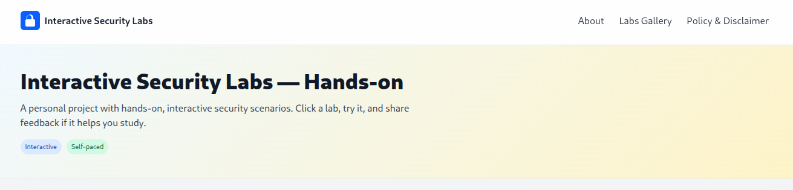
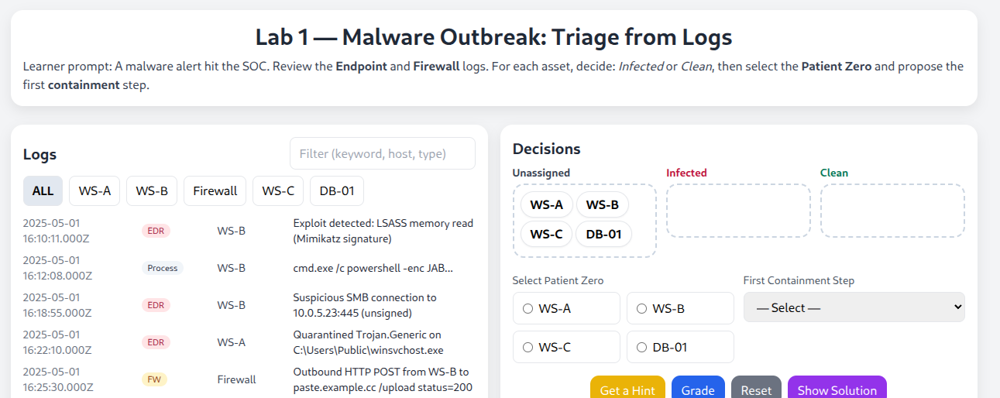
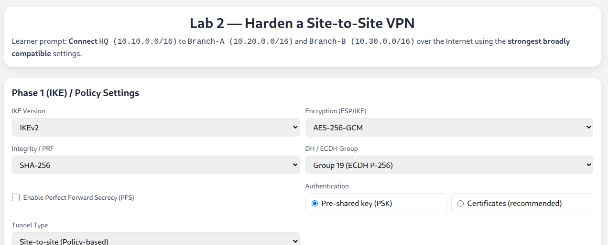
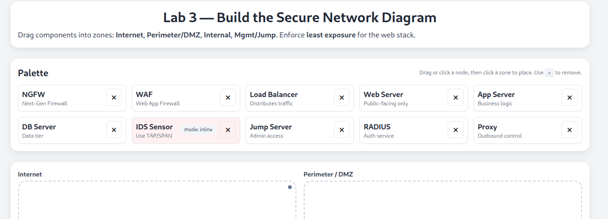
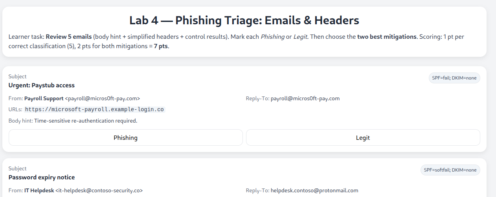
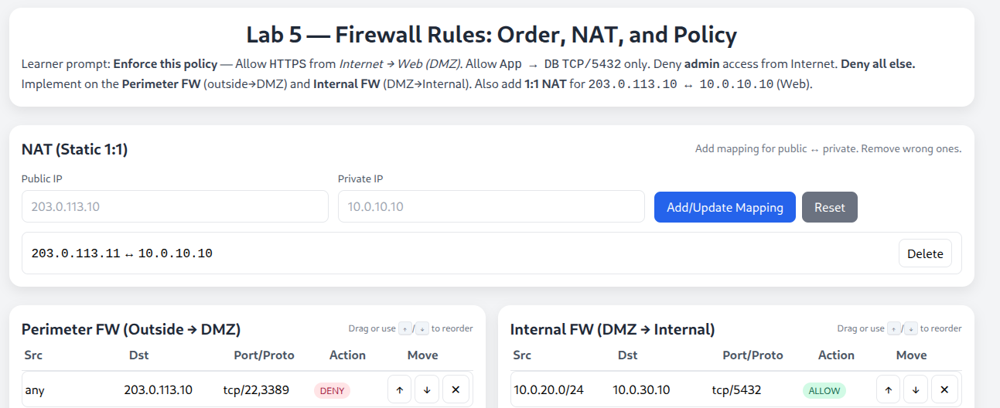

# Interactive Security Labs Hub 🔐  

Hands-on, browser-based mini-labs for practicing practical security decisions — triage phishing emails, harden VPNs, order firewall rules, and more. 

**Explore the platform here:** https://secured-labs.pages.dev

**No login. No install. Free to try.**  

 
  

---

## Home Preview 🖥️  

*Welcome screen of the Interactive Labs Hub*  

  
<!-- Replace with a real screenshot of your homepage -->  

---

## Labs 🚀  

Short, focused labs to build your skills quickly. Click a lab, try it, and get instant scoring and feedback.  

| #  | Lab Title                         | Screenshot Preview                  | Link                                   |
|----|-----------------------------------|-------------------------------------|----------------------------------------|
| 1  | Phishing Triage: Emails & Headers |                 | [Launch](https://secured-lab01.pages.dev) |
| 2  | Harden a Site-to-Site VPN         |                 | [Launch](https://secured-labs02.pages.dev) |
| 3  | Build the Secure Network Diagram  |                 | [Launch](https://secured-labs03.pages.dev) |
| 4  | Phishing Triage (alt set)         |                 | [Launch](https://secured-labs04.pages.dev) |
| 5  | Firewall Rules: Order & NAT       |                 | [Launch](https://secured-labs05.pages.dev) |

> *Tip: Each lab takes just a few minutes.*  

---

## About the Project 💡  

A personal project to share interactive security scenarios that mirror real-world tasks:  
- Triaging suspicious emails ✉️  
- Placing network devices in the right zones 🌐  
- Hardening VPN settings 🔒  
- Ordering firewall rules for least privilege 🛡️  

**Format:** Focused, scenario-driven, instant feedback  
**Tech:** Static HTML/JS with Tailwind, deployable anywhere  
**Audience:** Students, career-switchers, and practitioners  

---

## Roadmap 🗺️  

- [ ] More network & identity labs (cloud/IAM, segmentation, logging) ☁️  
- [ ] Branching simulations with deeper feedback 🔄  
- [ ] Premium packs for advanced learners 💼  

---

## Feedback 💬  

Have an idea or found a bug?  

- Quick form: [Google Form](https://docs.google.com/forms/d/e/1FAIpQLScOcZQZsGu9u8VaVzwgymYbCSvT83NU66OZENL5V-JBCO1Xog/viewform)  
- Or [open an Issue](../../issues)  

---

## Notes 📝  

- This repo is for **info and updates only** (no source code).  
- Not affiliated with or endorsed by any vendor or exam body.  
- Built with ❤️ for learners.  

